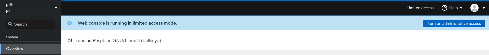

<table border="0">
  <tr>
    <td align="left" valign="middle">
    <h1>Wi-SUN Border Router Graphical User Interface</h1>
  </td>
  <td align="left" valign="middle">
    <a href="https://wi-sun.org/">
      
    </a>
  </td>
  </tr>
</table>

> [!IMPORTANT]  
> As of **wisun-br-gui v2.0.0**, the GUI will no longer support wisun-br-linux  versions earlier to **wisun-br-linux v2.0**.

The Wi-SUN border router GUI is a companion tool for Silicon Labs' Wi-SUN border router reference design, [wsbrd](https://github.com/SiliconLabs/wisun-br-linux).  
The tool helps manage the network by enabling a remote border router configuration and provides a visual representation of the connected Wi-SUN devices.

# Quick Start Guide

## Prerequisites

### wisun-br-linux Setup

To access the graphical interface, a running wsbrd instance is necessary.  
For more details on the Linux border router installation, follow the [Wi-SUN Linux Border Router Quick Start Guide](https://github.com/SiliconLabs/wisun-br-linux/blob/main/README.md).

At the end of the installation process, make sure to create your own configuration file.  
It must be located at `/etc/wsbrd.conf`.  
You may create this configuration file by simply copying the configuration file example:

```sh
sudo cp /usr/local/share/doc/wsbrd/examples/wsbrd.conf /etc
```

### Cockpit Setup

As this project is intended to be used as a Cockpit plugin, Cockpit must be installed.

Follow the instructions provided by Cockpit to install it: <https://cockpit-project.org/running.html>

### Dependencies Installation

On Debian/Ubuntu:

```sh
sudo apt install make
```

On Fedora:

```sh
sudo dnf install make
```

### Node.js Installation

Node.js and npm will also be necessary to build the project. It is recommended to install the LTS version of Node.js. The two tools with appropriate versions can be downloaded from [NodeSource - Node.js Binary Distributions](https://github.com/nodesource/distributions) .

## Installation

First, start by cloning the wisun-br-gui repository:

```sh
git clone https://github.com/SiliconLabs/wisun-br-gui
```

Then build the plugin with the following command:

```sh
make
```

And finally, use the following command to install the plugin:

```sh
sudo make install
```

> Note that this command will install the plugin for all users. To install the plugin only for the connected user, run this command instead `DEST_DIR=~/.local make install`

## Getting Started

### Cockpit Launch

Cockpit features are accessible through its Web interface. It is available at `http://[border router server]:9090/`.  
If the plugin was installed correctly, it should appear in the left side panel of Cockpit's Web interface as `Wi-SUN Border Router`.


### Administrative Access

To be able to use the Wi-SUN GUI, a user should have **Administrative access** to Cockpit.  
This can be achieved by *turning on Administrative access* from the **Turn on administrative access** button or **limited access** button shown in the image below and entering the pi password.



### Wi-SUN Dashboard

The Wi-SUN Dashboard tab provides direct access to `wsbrd.conf` configuration file. It gives the ability to change your wsbrd configuration without the need to physically access the Raspberry Pi. The Wi-SUN Border Router service box allows the user to start, restart or stop the Wi-SUN Border Router service by clicking the three dots dropdown. The other boxes expose the Wi-SUN Border Router active configuration.


### Wi-SUN Topology

As its name indicates, the Wi-SUN Topology tab draws the Wi-SUN network topology. The canvas is dynamic and uses the Auto Zoom to fit the network on the user screen. This functionality can be disabled by unchecking the `Auto Zoom` box. The interactive capability of the network gives you the ability to check the properties of every node of the network through the `Device Properties` Box.


## Development

For development purposes, the module can be run directly from the git
tree with the following command:

```sh
make devel-install
```

After changing the code and running `make` again, reload the Cockpit page in
the browser.

To automatically update the bundle on every code change, use the [watch mode](https://webpack.js.org/guides/development/#using-watch-mode) with following command.

```sh
make watch
```

## Reporting Bugs and Issues

To report bugs in the Application Examples projects, please create a new "Issue" in the "Issues" section of this repo. Please reference the board, project, and source files associated with the bug, and reference line numbers. If you are proposing a fix, also include information on the proposed fix. Since these examples are provided as-is, there is no guarantee that these examples will be updated to fix these issues.

Questions and comments related to these examples should be made by creating a new "Issue" in the "Issues" section of this repo.

## Disclaimer

The Gecko SDK suite supports development with Silicon Labs IoT SoC and module devices. Unless otherwise specified in the specific directory, all examples are considered to be EXPERIMENTAL QUALITY which implies that the code provided in the repos has not been formally tested and is provided as-is. It is not suitable for production environments. In addition, this code will not be maintained and there may be no bug maintenance planned for these resources. Silicon Labs may update projects from time to time.
